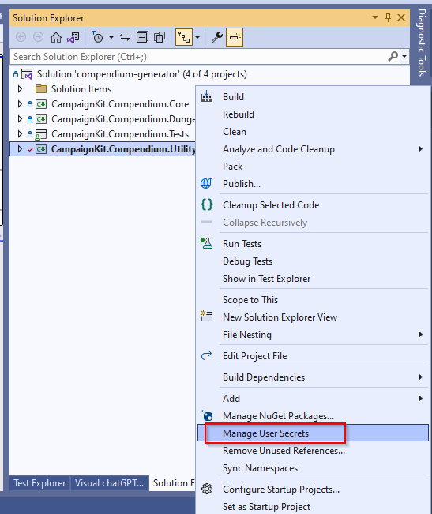

# CompendiumGenerator
> Bringing open source table top roleplaying game (TTRPG) compendiums to your favourite campaign management toolbox.

CompendiumGenerator is a utility designed to improve the gaming experience for the [CampaignLogger](https://campaign-logger.com/) application.  By leveraging open-sourced RPG data sets, CompendiumGenerator is able to produce rule set compendiums that can be imported into CampaignLogger.

You do not need to run the utility yourself to create the compendiums.  All generated compendiums can be found in the project's [data directory]("https://github.com/open-campaign-logger/compendium-generator/tree/main/data").

## Installing / Getting started

This application was developed in C# using the cross-platform .Net 7 SDK.

Visual Studio Community Edition was used for development work but you don't need to use Visual Studio.  The application can be built, tested and executed from the commandline using .Net CLI.

### Required Software
* [Git](https://git-scm.com/download/win)/[TortoiseGit](https://tortoisegit.org/)
* [Microsoft .Net 7 SDK](https://dotnet.microsoft.com/en-us/download/dotnet/7.0)

### Optional Softare
* [Microsoft Visual Studio Community 2022](https://visualstudio.microsoft.com/vs/community/)
	* Install the ".Net Desktop Development" workload.
    * [CodeMaid](https://www.codemaid.net/) VS Extension - For reording and reformatting class elements.
    * [MarkdownEditor2022](https://github.com/MadsKristensen/MarkdownEditor2022) VS Extension - Facilitates the creation of Markdown files like this one.
    * [Visual chatGPT Studio](https://marketplace.visualstudio.com/items?itemName=jefferson-pires.VisualChatGPTStudio) VS Extension - Adds chatGPT functionality directly within Visual Stuio.  OpenAI API key required.

### Workspace Setup
Execute the following
``` shell
git clone https://github.com/open-campaign-logger/compendium-generator.git
cd ./compendium-generator
dotnet build
dotnet test
dotnet run --project CampaignKit.Compendium.Utility
```

This will download the solution, install dependencies, perform a build, run automated unit tests then execute the utility.

## Features

The following compendiums are currently supported:

### Dungeons & Dragons 5th Edition Bestiary
A collection of open-sourced, 5e compatible monsters derived from the following [open5e-api ](https://github.com/open5e/open5e-api) data sets:
* **Systems Reference Document** (Wizards of the Coast)
* **Tome of Beasts**, (Kobold Press)
* **Tome of Beasts2 2**, (Kobold Press)
* **Tome of Beasts 3**, (Kobold Press)
* **Creature Codex**, (Kobold Press)
* **Monstrous Menagerie**, (Kobold Press)

The application is currently configured to create two different compendiums from these data sets:
* **5e Bestiary.json** - Full set of 2,136 monsters.
* **5e Bestiary Test.json** - 4-5 monsters from each set.  Used for quick testing and validation.

## Configuration

A standard .Net `appsettings.json` file is used to configure the application.

```json
{
  // List of compendiums to process.
  "Compendiums": [
    {
      // DI service class to use for processing this compendium.
      "CompendiumService": "CampaignKit.Compendium.DungeonsAndDragons.Services.DefaultDungeonsAndDragonsCompendiumService_5e",
      // Description of the compendium.
      "Description": "Preformatted 5e monsters from the SRD and Kobold Press.",
      // Image to use for the compendium.
      "ImageUrl": "https://campaign-logger.com/images/campaign-logger.png",
      // List of source data sets to parse and compile into the compendium.
      "SourceDataSets": [
        {
          // Limits number of items to parse from the source data set.
          // Generally this is only used for testing purposes when you only want a limited number of items to include in the compendium.
          "ExportLimit": 5,
          // Class to use for parsing license information.
          "LicenseDataParser": "CampaignKit.Compendium.DungeonsAndDragons.Common.License",
          // URI of license information.
          "LicenseDataURI": "https://raw.githubusercontent.com/open5e/open5e-api/main/data/WOTC_5e_SRD_v5.1/document.json",
          // Controls whether to always download source data files or to only download once.
          "OverwriteExisting": false,
          // Descriptive name of the source data set.
          "SourceDataSetName": "Dungeons & Dragons SRD - Monsters",
          // Class to use for parsing source data information.
          "SourceDataSetParser": "CampaignKit.Compendium.DungeonsAndDragons.SRD.SRDCreature",
          // URI of source data set.
          "SourceDataSetURI": "https://raw.githubusercontent.com/open5e/open5e-api/main/data/WOTC_5e_SRD_v5.1/monsters.json"
        },
		...
      ],
      // Compendium title.
      "Title": "5e Bestiary - Test"
    },
    ...
  ],
  // Standard .Net environment and logging settings.
  "Environments": {
    ...
  },
  // This is where source data sets will be downloaded to and where compendiums
  // will be generated.  
  // 
  // If you leave this blank files will be stored in a temporary directory.
  // Windows Temporary Directory: `C:\Users\[Username]\AppData\Local\Temp`
  // LinuxTemporary Directory: Resolves to the value of the environment variable `TMPDIR`, which is usually set to `/tmp`.
  "RootDataFolder": ""
}
```

Visual Studio has built in support for user secrets that you can use to provide configuration overrides during development.



This is especially helpful for the `RootDataFolder` configuration element found in `appsettings.json` which will differ in each developer's environment.

```json
{
  "RootDataFolder": "D:\\source\\compendium-generator\\data"
}
```

## Contributing

### Deserializing JSON Files

[json2csharp](https://json2csharp.com/) can be used to create C# classes for deserializing JSON source data sets.

Recommended json2csharp settings:
* Use Nullable Types
* Add JsonProperty Attributes
* Use Pascal Case

Once a JSON deserialization class has been created perform the following steps to customize the code:
* Add "?" nullable type operator for each property
* set a default value for each property.  Examples:
   * `public string? Alignment { get; set; } = string.Empty;`
   * `public int? AnimalHandling { get; set; } = int.MinValue;`
   * `public List<Action>? Actions { get; set; } = new List<Action>();`

## Links

* [Campaign Logger](https://campaign-logger.com/)
* [Role Playing Tips](https://www.roleplayingtips.com/)
* [Campaign Community](https://campaign-community.com/)
* [Open5e API](https://github.com/open5e/open5e-api)

## Licensing

Copyright (c) 2017-2021 Jochen Linnemann, Cory Gill.

Licensed under the Apache License, Version 2.0 (the "License");
you may not use this file except in compliance with the License.
You may obtain a copy of the License at

    http://www.apache.org/licenses/LICENSE-2.0

Unless required by applicable law or agreed to in writing, software
distributed under the License is distributed on an "AS IS" BASIS,
WITHOUT WARRANTIES OR CONDITIONS OF ANY KIND, either express or implied.
See the License for the specific language governing permissions and
limitations under the License.


